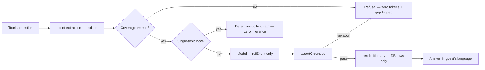
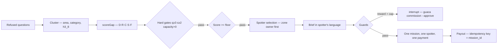
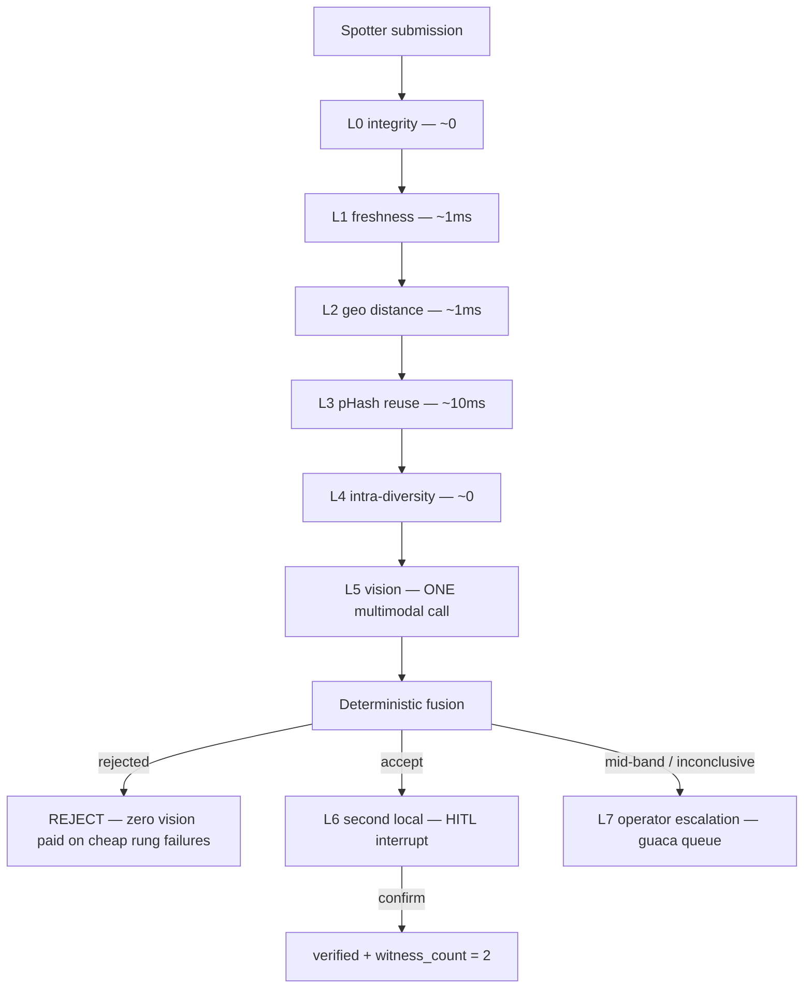

# GUACA — Agentic workflows

## Planner agent

## Gap agent

## Verification agent — the check ladder

**HITL points are marked by `interrupt()`:**
- `requestSecondLocal` interrupts for a *different* spotter's confirmation.
- `visionVerify` is a SEPARATE node — resume re-runs only the interrupting
  node, so the interrupt/resume cycle pays for vision exactly once.
- Every write past an interrupt is idempotency-keyed.

## Check-ladder cost table

| # | Check | Cost | Threshold |
|---|---|---|---|
| L0 | Integrity | ~0 | any fail → hard |
| L1 | Freshness | ~1ms | >24h outside → hard |
| L2 | Geo distance | ~1ms | ≤75m PASS · 75–250m WEAK · >250m hard · absent INCONCLUSIVE |
| L3 | pHash | ~10ms | Hamming ≤6 → PHOTO_REUSE · 7–12 WEAK · >12 PASS |
| L4 | Diversity | ~0 | min pairwise <10 → NO_DIVERSITY |
| L5 | Vision | paid | structured verdict, all photos in one call |
| L6 | Second local | human | CONFIRM / DENY / TIMEOUT(72h) |
| L7 | Operator | human | APPROVE / REJECT / REQUEST_MORE |

Fusion is deterministic — no model in the decision.
