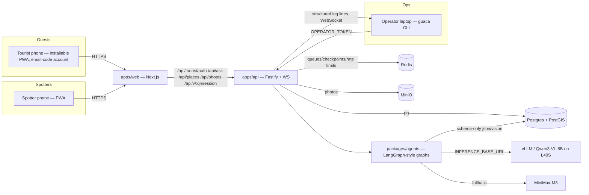
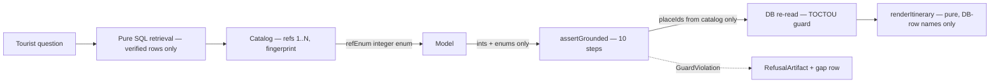

# GUACA — Architecture

## System shape

## Packages

| Package | Responsibility |
|---|---|
| `packages/shared` | zod schemas, taxonomy, log line types — THE contract |
| `packages/db` | raw SQL migrations, typed query functions, seed, loop thread |
| `packages/agents` | Catalog, assertGrounded, lexicalSweep, renderer, inference client, verification ladder, planner, gap agent |
| `packages/cli` | `guaca` operator CLI — queue, verify, gaps, missions, tail |
| `apps/api` | Fastify + WebSockets — ask, plan, places, photos, spotter session |
| `apps/web` | Next.js installable PWA — role-chooser entry; (tourist) map + chat behind email-code account; (spotter) capture; /v/[qrToken] villa landing = no-auth signup funnel with property attribution |

## The core claim: the AI never generates a place

The model's entire output vocabulary is the integers 1..N. The output
schema is `.strict()` with no string field that can name a place; the
dependency-cruiser rule forbids `src/render → src/inference` as a build
failure. 10 000 randomly generated hostile outputs produce zero
unwitnessed places (property test A2).

## Compute efficiency

| Decision | Saving |
|---|---|
| Refusal decided from the coverage index before retrieval | zero tokens on the most common failure path |
| Deterministic fast path for single-topic "now" questions | ~60% of answers use zero inference |
| Topic classification by lexicon first | ~1 classification call per gap run |
| L0–L4 short-circuit before the vision call | ~60–75% of bad submissions cost nothing |
| All photos in one multimodal request | 1 call instead of N |
| L40S over H200 | the 8B model cannot use 141GB; ~2.9× cheaper |
